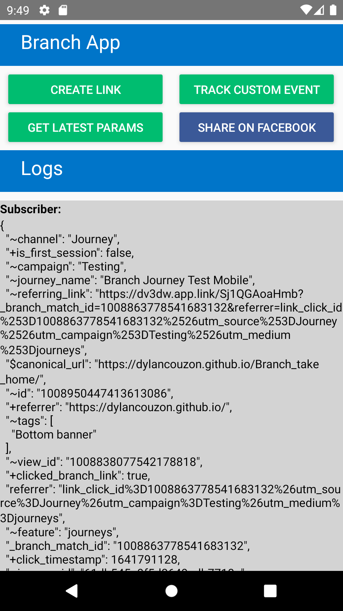
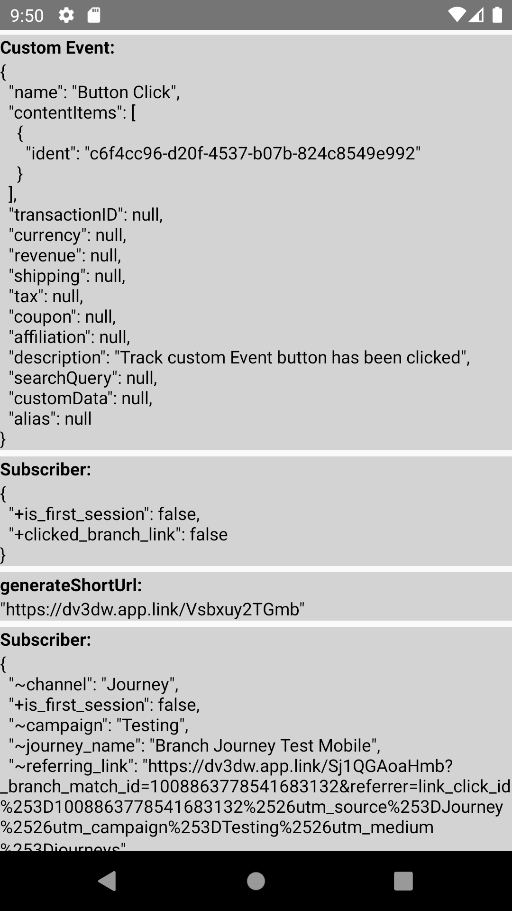

# React Native Branch SDK Implementation

React Native app created for Branch SE Technical Assessment

## App functionalities:
* Create a shareable Deeplink
* Install through Deeplinks
* Pass context through Install
* Create and Log custom Events
* Retrieve & log Branch data from a deep link
* Share Deeplink on Facebook

[Direct Download](https://github.com/Dylancouzon/Branch_take_home/raw/main/SE_DYLAN_COUZON.apk)

[Journey Demo](https://dylancouzon.github.io/Branch_take_home/) (Android only)

# Prerequisites

    Android API level 30 (Play Store Activated)

# Installation

    cd {$repo-path} && npm install

# Start Application

    react-native run-android