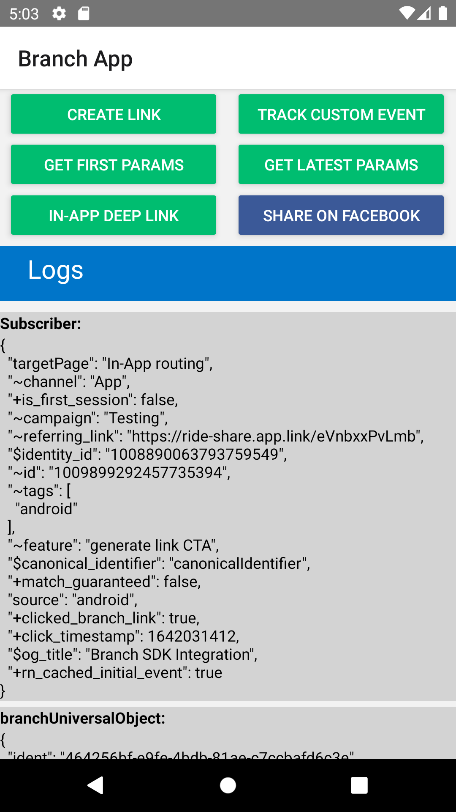

# React Native Branch SDK Implementation

React Native app created for Branch SE Technical Assessment

## App functionalities:
* Create a shareable Deeplink
* Install through Deeplinks
* Pass context through Install
* Create and Log custom Events
* Retrieve & log Branch data from a deep link
* Share Deeplink on Facebook
* In App deep link routing

[Direct Download](https://github.com/Dylancouzon/Branch_take_home/raw/main/SE_DYLAN_COUZON.apk)

[Journey Demo](https://dylancouzon.github.io/Branch_take_home/) (Android only)

# Prerequisites

    Android API 30+ (Play Store Activated)
    Android SDK Build-Tools 32

# Installation
    git clone git@github.com:Dylancouzon/SE_Technical_Assessment.git
    cd SE_Technical_Assessment && npm install

Open the Project in your window explorer, then go to the android directory and create a file named:
    
    local.propreties

Open the file & link your android SDK path like below:

    Windows: sdk.dir=C:\\Users\\UserName\\AppData\\Local\\Android\\sdk
    Mac: sdk.dir = /Users/USERNAME/Library/Android/sdk

# Start Application

Run the Command:

    react-native run-android